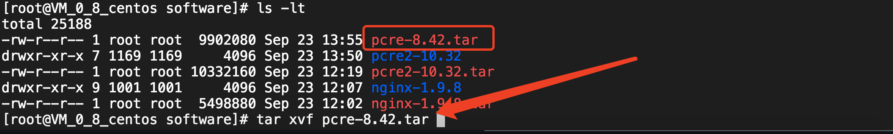

## nginx安装
------
+ 安装环境
+ 安装步骤

### 安装环境
------
```
1. nginx v1.9.8
源码下载地址：http://nginx.org/download/
安装文档地址：http://nginx.org/en/docs/configure.html

2. linux os 版本
内核版本：centos 3.10.** 内核

3. gcc&gcc-c++和make 版本
gcc版本：version 4.8.5
make版本：Make 3.82
```

### 安装步骤
------
1. 安装rz和sz工具
yum install lrzsz

2. 安装pcre
	2.1 下载源码并解压
	下载地址：https://ftp.pcre.org/pub/pcre/
	

	2.2 编译安装
	./configure --prefix=/usr/local/pcre
	make && make install

3. 安装openssl
yum install openssl
yum install openssl-devel

4. 安装nginx
	./configure --prefix=/usr/local/nginx --with-http_ssl_module --with-pcre=../pcre-8.42
	备注：pcre2版本在编译nginx时会异常。